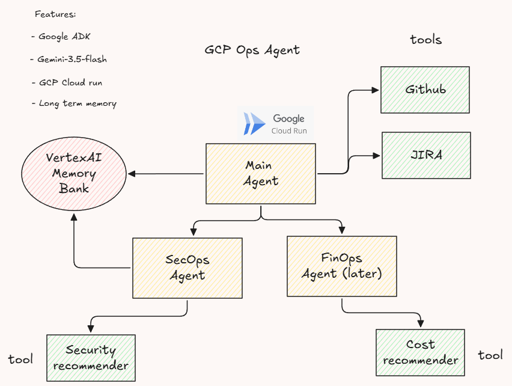

# GCP Ops Agent (Taskmaster)

## The Need?
Managing Google Cloud recommendations can be challenging. Developers and Engineering managers often need to track costs, enforce security policies, and respond to incidents promptly. An issue with GCP recommendations is that they sit within GCP and are not easily `actionable` from external tools

## The Solution
A multi-agent system built with Google ADK that helps Developers and Engineering managers interact with Google Cloud recommendations directly via an Agent. It surfaces Security and FinOps recommendations, and can automatically create Jira tickets and GitHub worktree branches from these GCP findings

## The Benefits
The focus extends from merely detecting issues to actively remediating them, bridging the gap between **Insight** and **Action**

## The Architecture

|  |
| :---: |

The architecture consists of a root agent (`main_agent`) that delegates tasks to specialized sub-agents with their respective tools. 

### The Main Agent

**Role:** Acts as the root agent, delegating tasks to specialized sub-agents and coordinating overall operations.

**Tools:** 
- `delegate_to_secops` — Delegates security-related tasks to the SecOps agent
- `delegate_to_finops` — Delegates financial operations tasks to the FinOps agent (for later development)
- `create_jira_story` — Creates a Jira ticket from a GCP finding (records it in memory as *handled*)
- `create_fix_branch` — Creates a GitHub fix branch with remediation context (records it in memory as *handled*)

### The SecOps Agent

**Role:** Handles security-related tasks, including incident response, IAM issues, SCC findings, and proactive security recommendations.

**Tools:** 
- `get_security_recommendations` — Lists active Recommender findings, decorated with *pending* / *already_handled* status

### The FinOps Agent (for later development)
**Role:** Handles financial operations tasks, including cost management, budget enforcement, and billing anomaly detection.
**Tools:** 
- `get_financial_recommendations` — Lists active financial recommendations, decorated with *pending* / *already_handled* status


## Long-running memory (Vertex AI Memory Bank)

The agent uses ADK's [`MemoryService`](https://adk.dev/sessions/memory/) to persist **which
GCP Recommender findings have already been handled** across sessions. When a Jira story or
GitHub fix branch is filed against a specific finding — or when the user explicitly marks it
resolved / snoozed / wont_fix — the finding is written to long-term memory. The next time
`get_security_recommendations` runs (in a **brand new** session), those items come back
tagged `already_handled` with the linked Jira key or branch name, so the agent skips
remediation and just cites the prior action.

Backend selection (in `main_agent/utils/memory.py`):

| Env `AGENT_ENGINE_ID` | Memory service used |
|---|---|
| set | `VertexAiMemoryBankService` (persistent, managed by Vertex AI Agent Engine) |
| unset | `InMemoryMemoryService` + process-local index (local dev fallback) |


## Running locally

```cmd
pip install -r main_agent/requirements.txt
```

```cmd
adk run main_agent
```

## Deploy to GCP

Set once per shell:

```cmd
SET GOOGLE_CLOUD_PROJECT=prasad-gcp4-project
SET GOOGLE_CLOUD_LOCATION=europe-west2
SET SERVICE_NAME=gcp-ops-service
SET APP_NAME=gcp_ops_agent
SET AGENT_PATH=./main_agent
SET GEMINI_MODEL=gemini-3.5-flash
SET AGENT_ENGINE_ID=5598757189100503040
```

Deploy the agent to Cloud Run:

```cmd
adk deploy cloud_run --project=%GOOGLE_CLOUD_PROJECT% --region=%GOOGLE_CLOUD_LOCATION% --service_name=%SERVICE_NAME% --app_name %APP_NAME% --with_ui %AGENT_PATH% ^
  -- --set-env-vars=GOOGLE_GENAI_USE_VERTEXAI=TRUE,GOOGLE_CLOUD_PROJECT=%GOOGLE_CLOUD_PROJECT%,GOOGLE_CLOUD_LOCATION=%GOOGLE_CLOUD_LOCATION%,GEMINI_MODEL=%GEMINI_MODEL%,AGENT_ENGINE_ID=%AGENT_ENGINE_ID%,PROJECT_LOCATION=%GOOGLE_CLOUD_LOCATION%
```

## Test on Cloud Run

After deploying the agent to Cloud Run, you can test it by opening the `dev-ui` in your browser:

```
https://gcp-ops-service-664004376005.europe-west2.run.app/dev-ui/?app=gcp_ops_agent
```
